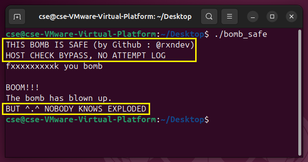

# MYBS
***Make Your Bomb Safe!***

## Overview

`MYBS`는 CSAPP BombLab 문제 파일을 입력받아,
호스트 인증 절차를 제거하고 폭발(실패)해도 아무 로그를 남기지 않도록 패칭해주는 도구입니다.

~~터질까봐 걱정하지 말고 안전한 과제를 합시다.~~

## Usage
1. 패칭할 BombLab 문제 파일(`bomb`)을 준비합니다.
2. `MYBS`를 실행하고 대상 파일을 입력합니다.
3. 패치가 완료된 파일(`bomb_safe`)을 사용합니다.

## Safe Bomb
`MYBS`가 생성한 **Safe Bomb**(`bomb_safe`)에는 구체적으로 아래 패칭이 적용됩니다.
1. Host 인증이 제거됩니다. 따라서 본인 소유의 임의의 로컬 리눅스 시스템에서 실행할 수 있습니다.
2. 폭발(실패)시 로그를 남기는 기능이 제거됩니다. 따라서 폭발하여도 감점되지 않습니다.
3. 해제(성공)시 로그를 남기는 기능이 제거됩니다. 따라서 주어진 문제를 Defuse 하여도 득점되지 않습니다.

이외의 모든 동작(주어진 문제 등)은 입력 파일과 100% 동일하게 작동합니다.

## Warning
- 이 툴은 교육적 목적으로만 사용해야 합니다.
- 무단 사용으로 인한 책임은 사용자 본인에게 있습니다.
